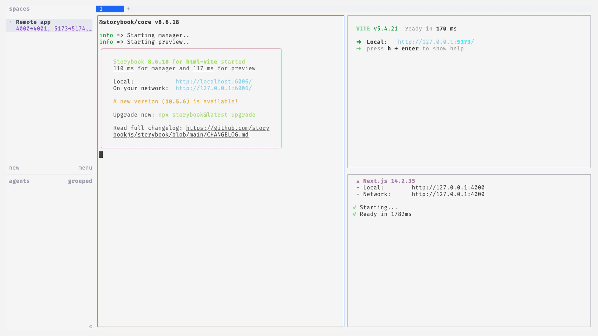
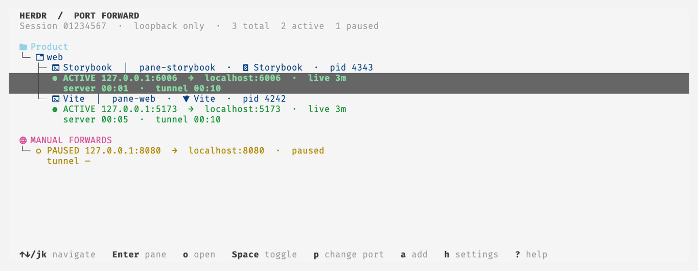
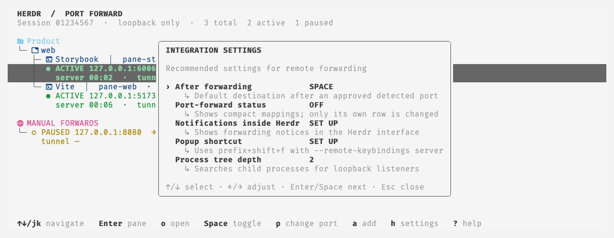

# herdr-fwd

Automatically expose development servers from a remote Herdr session on your
local machine. Herdr Fwd discovers loopback TCP listeners owned by processes in
remote panes, opens SSH forwards, and presents them in a native terminal
dashboard—without manually maintaining `ssh -L` arguments.

<picture>
  <source media="(prefers-color-scheme: dark)" srcset=".github/assets/demo/overview-dark.gif">
  <source media="(prefers-color-scheme: light)" srcset=".github/assets/demo/overview-light.gif">
  
</picture>

The overview follows the real remote flow: Storybook, Vite, and Next.js run in
separate panes of a clean named Herdr session, `hfwd` attaches through SSH, and
the plugin discovers their loopback listeners before opening the live dashboard
overlay. The recording restores the prior Herdr configuration and deletes the
demo session afterward.

## Requirements

- Herdr 0.9.x on both the local connecting machine and remote plugin host;
- macOS or Linux;
- `ps` plus `lsof` on macOS, or `ps` plus `lsof`/`ss` on Linux;
- `git`, `curl`, `tar`, and `sha256sum` or `shasum` for direct plugin install;
- Rust and Cargo for source development only; released plugin installation uses verified archives;
- OpenSSH and a working SSH target for outgoing remote connections; and
- an SSH agent or keychain when using a passphrase-protected key.

## Quick start

Herdr Fwd has two roles: the **local connecting machine** runs `hfwd` and
owns the SSH forwards, while the **remote hosting machine** runs Herdr, the
plugin, and the development servers. One machine can do both.

1. On the remote hosting machine, install the plugin:

   ```bash
   herdr plugin install go-min/herdr-fwd
   ```

2. On a separate local connecting machine, install `hfwd` with
   [the installer](#install-hfwd) or Homebrew. The welcome popup runs on the
   plugin host, so it can install `hfwd` only when that machine also hosts the
   plugin and remote session.
3. Configure an SSH host or alias for the remote machine, for example:

   ```sshconfig
   Host devbox
     HostName dev.example.test
     User developer
   ```

4. Start the remote session and automatic forwarding:

   ```bash
   hfwd <target> --open
   ```

   Replace `<target>` with the SSH host or alias from the previous step.
5. Start a development server in a remote Herdr pane. Herdr Fwd forwards its
   loopback listener to the local machine automatically.

## Install the plugin

Install Herdr Fwd on each remote hosting machine whose development servers you
want to expose:

```bash
herdr plugin install go-min/herdr-fwd
```

Herdr shows the repository and build commands for confirmation. The build hook
downloads the matching checksum-verified plugin binary. A missing or
unverifiable release asset is an error: production installation never builds
the plugin from the checkout with Cargo. Herdr then enables it for the current user.
Launch or reattach Herdr:

```bash
herdr
```

On its first local run, the plugin opens a welcome popup on the
machine that hosts the plugin and remote Herdr session. It asks whether that
same machine will connect, host, or do both. Connecting and combined roles make
**Install hfwd** the primary setup action; it installs `hfwd` on that same
machine only. For a separate local connecting machine, install `hfwd` with
[the installer](#install-hfwd) or Homebrew. Hosting-only explains that `hfwd`
is optional. After a role is chosen, the popup also offers the secondary
forwarded-port status and server-side dashboard shortcut toggles.

When `hfwd` installs the plugin automatically on a remote machine, the popup
is suppressed for that remote session. A later local run explains how the
plugin arrived and also offers a quick uninstall action. After the popup is
closed normally, it is not shown again. This choice is stored in
`~/.config/herdr-fwd/config.toml`. A new configuration defaults to
`onboarding = true`; reinstall and update preserve the user's existing value.
Separate state under `~/.local/state/herdr-fwd/plugin-origin.toml` records only
an installation first created by `hfwd` on a remote host. That metadata selects
the remote-origin popup only while its recorded root matches the running plugin.

## Install hfwd

The welcome popup can install `hfwd` only on the machine hosting the plugin and
remote session. To install `hfwd` on a separate local connecting machine,
choose either the checksum-verified script or Homebrew:

```bash
curl -fsSL \
  https://raw.githubusercontent.com/go-min/herdr-fwd/main/install.sh | sh
```

```bash
brew install go-min/tap/herdr-fwd
```

The script installs to `~/.local/bin` by default. Pin a release with
`--version 0.1.5`, or download and inspect the root `install.sh` before running
it. The installed command is `hfwd`; the project and Homebrew formula remain
named `herdr-fwd`. Homebrew upgrades use the standard
`brew upgrade herdr-fwd` command.

## Connect

Use any OpenSSH destination, including an alias from `~/.ssh/config`:

```sshconfig
Host devbox
  HostName dev.example.test
  User developer
  ServerAliveInterval 15
```

Start a remote Herdr session with forwarding enabled:

```bash
hfwd <target> --open
```

Replace `<target>` with the SSH host or alias for the remote machine. The
`hfwd` command verifies Herdr compatibility, installs or updates the exact
matching plugin version on that host, and launches `herdr --remote <target>`.
Every detected development listener is forwarded automatically. The dashboard
destination is configured in Herdr: Space, dashboard popup, or nothing.
Inside a remote pane, start a development server as usual:

```bash
pnpm dev
```

Within a few seconds the `Port Forwarding` Space shows a mapping such as:

```text
● 127.0.0.1:5173  →  localhost:5173  ·  live 0m
```

If local port `5173` is occupied, the next available loopback port is selected.
Stopping the owning process removes all of its forwards. Exiting the attached
Herdr client closes the `hfwd`-owned SSH master, forwards, and session state.

## Common commands

```bash
hfwd <target> --open
hfwd <target> -- --session agents
hfwd doctor <target>
hfwd list
hfwd status
hfwd forward <target> 4173
hfwd forward <target> 4173 5174
hfwd close 5173
hfwd close-all
```

`hfwd forward` adds a persistent manual loopback mapping to an already active
session. The optional final port chooses the local port; otherwise it uses the
same port as the remote service.

To keep typing the normal Herdr command, install the shell hook once. The
command detects zsh, Bash, or Fish from `$SHELL` and updates only that shell's
configuration:

```bash
hfwd hook install
```

Pass the shell explicitly when needed:

```bash
hfwd hook install zsh
hfwd hook install bash
hfwd hook install fish
```

Alternatively, evaluate a non-persistent hook in the current zsh or Bash
session with `eval "$(hfwd hook zsh)"` or `eval "$(hfwd hook bash)"`. After
installation, only
`herdr --remote <target>` is routed through Herdr Fwd; all other Herdr commands
continue to call the original executable unchanged.

## Dashboard

Automatic forwards are grouped by Space, tab, pane, and process identity.
Duplicate Space or tab names remain separate. Each process shows its PID, and
each mapping shows server start time, tunnel-open time, and live or paused
state. Manual mappings use the same visual language in their own section.

In Herdr 0.9, sidebar layout and notification delivery belong to the local
client. Dashboard settings (`h`) update that machine through `hfwd`; apply them
with **reload config** in Herdr's menu, or detach and reconnect. The popup
shortcut remains in the remote configuration and uses `--remote-keybindings server`.

The main actions are:

- `↑`/`↓` or `j`/`k` to navigate;
- `Enter` to focus the source pane and `o` to open the local URL;
- `Space` to pause or resume a mapping;
- `p` to choose a different local port;
- `a` to create a manual loopback mapping;
- `d` to remove a manual mapping;
- `h` to open integration settings; and
- `?` for contextual help.

Paused automatic ports and manual mappings are restored per resolved remote
host, so state does not leak between machines. See the complete
[plugin and dashboard guide](docs/plugin.md) for persistence, notifications,
sidebar metadata, popup views, and every keyboard action.

This recording starts with Storybook selected, moves to Vite, and pauses its
mapping. The state change happens through the dashboard's normal companion API,
not a pre-rendered terminal frame.

<picture>
  <source media="(prefers-color-scheme: dark)" srcset=".github/assets/demo/dashboard-dark.gif">
  <source media="(prefers-color-scheme: light)" srcset=".github/assets/demo/dashboard-light.gif">
  
</picture>

### Integration settings

Open `h` in the dashboard to adjust the post-forward destination, sidebar
status, notifications, popup shortcut, and process-tree depth. The recording
opens this menu from the same dashboard fixture, so every visible setting is a
real plugin control.

<picture>
  <source media="(prefers-color-scheme: dark)" srcset=".github/assets/demo/settings-dark.gif">
  <source media="(prefers-color-scheme: light)" srcset=".github/assets/demo/settings-light.gif">
  
</picture>

## Update and remove

Reinstall the plugin to update a user-managed installation:

```bash
herdr plugin install go-min/herdr-fwd
```

For an outgoing remote host, update the local `hfwd` command first, disconnect
active forwarding sessions, and then install the matching remote plugin:

```bash
brew upgrade herdr-fwd                    # Homebrew installation
hfwd remote update <target>
hfwd doctor <target>
```

Remove the plugin from the current machine with:

```bash
herdr plugin uninstall herdr.fwd
```

For a source-linked development checkout, use `herdr plugin unlink herdr.fwd`
instead. `hfwd remote uninstall` selects the correct operation automatically
for its managed fallback bundle and clears its provenance state.

The welcome popup also provides this action when the plugin was installed by
`hfwd`. See [installation and operations](docs/operations.md) for script-based
upgrades, recovery, remote cleanup, and removing `hfwd`.

## Documentation

- [Plugin and dashboard guide](docs/plugin.md)
- [Installation and operations](docs/operations.md)
- [Known limitations](docs/limitations.md)
- [Security policy](SECURITY.md)

Development, testing, architecture, and release documentation starts in
[CONTRIBUTING.md](CONTRIBUTING.md).
